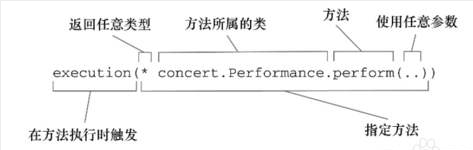

# Spring Aop 面向切面编程

切面能帮助我们模块化**横切**关注点。我们在一个地方定义通用的功能，通过声明的方法定义功能以何种方式在何处应用，而无需修改受影响的的类。横切关注点可以被模块化为特殊的类，这些类被称为切面（aspect）。

## 1. 简单的AOP例子

1.1 定义了一个简单接口

```java
package concert;
public interface Performance(){
    public void perform();
}
```

1.2 定义一个实现类

```java
@Component
public class MyPerformance implements Performance {
    @Override
    public void perform(){
        System.out.println("invoke perform()");
    }
}
```

1.3 定义一切面对上面这个接口实现bean(MyPerformance)进行增强(拦截)

```java
package aop;

@Aspect // 定义切面
public class Audience {
    @PointCut("execution(** concert.Performance.perform(..))") // 定义切点
    public void pointCut(){}
    
    // 调用前拦截
    @Before("pointCut()") 
    public void beforeHandle(){ // 定义通知
        System.out.println("before handle.");
    }
    // 调用后拦截
    @After("pointCut()")
    public void afterHandle(){ // 定义通知
        System.out.println("after handle.");
    }
    // 调用后正确返回拦截
    @AfterReturning("pointCut()")
    public void afterReturningHandle(){ // 定义通知
        System.out.println("after returning handle.");
    }
    // 调用后抛出异常拦截
    @AfterThrowing("pointCut()")
    public void afterThrowingingHandle(){ // 定义通知
        System.out.println("after throwing handle.");
    }
}

```

1.4 开启AspectJ自动代理

```java
@Configuration
@EnableAspectJAutoProxy // 在一个类上声明就可以，一般在主配置类上声明
@ComponentScan
public void ConcertConfig {
    @Bean
    public Audience audience(){ // 创建这个AOP切面bean
        return new Audience();
    }
}
```

1.5 测试验证

```java
@RunWith(SpringJunit4ClassRunner.class)
@ContextConfiguration(class=ConcertConfig.class)
public class AopTest {
    @Autowired
    private Performance performance;
    
    @Test
    public void test(){
        this.performance.perform();
    }
}
```

通过上面的例子，Audience Bean会对MyPerformance Bean增强(拦截)，当你调用通过ApplicationContext获取的Performance bean，并调用performance.perform()，其会输出如下：

before handle.

invoke perform()

after returning handle.

上面的输出，说明增强正确执行了。

## 2. 切点(PointCut)表达式

切点：通过AspectJ表达式来匹配要增强或拦截的方法。

### 2.1 表达式说明

Spring借助AspectJ的切点表达式语言来定义Spring切面。

| **指示器**  | **描述**                                                     |
| ----------- | ------------------------------------------------------------ |
| arg()       | 限制连接点匹配参数为指定类型的执行方法                       |
| @args()     | 限制连接点 匹配参数由指定注解标注的执行方法                  |
| execution() | 用于匹配是连接点的执行方法                                   |
| this()      | 限制连接点匹配AOP代理的bean引用为指定的类型的bean            |
| target      | 限制连接点匹配目标对象为指定类型的类                         |
| @target()   | 限制连接点匹配待定的执行对象，这些对象对应的类要具有指定类型的注解 |
| within()    | 限制连接点匹配指定的类型                                     |
| @within()   | 限制连接点匹配指定注解标注的类型（当使用spring AOP时，方法定义在由指定的注解所标注的类里） |
| @annotation | 限制匹配带有指定注解的连接点                                 |

注意：**只有execution指示器是实际执行的，而其他的指示器都是用来限制匹配的。**也就说只有execution匹配的切点才能被通知处理(拦截)，而其它的执行器只是起到限制条件的作用，如果限制条件不成立，则这个表达式无效，execution匹配的切点也就无效。看下面，2.2.2和2.2.3的例子说明。

### 2.2 例子

#### 2.2.1 简单表达式例子

例如：execution(* concert.Performance.perform(..))



上面的表达式会匹配concert包内的Performance类的perform()方法，方法表达式"*"开始，表示我们不关心方法的返回值类型。然后，我们指定了全限定类名和方法名。对应方法的参数列表，我们使用两个点号(..)表示切点要选择任意的参数类型和个数。

#### 2.2.2 and和within限制表达式例子

例如：execution(* concert.Performance.perform(..)) && within(concert.*)

在上面"简单例子"AspectJ基础上有加入 && within(concert.*)，其中：

**&&**，操作表示and寓意，把execution和within连在一起形成and关心。

**within(concert.*)**，within起到了限制的作用(这个条件必须成立)，否则execution不执行，例如：必须是concert包下的类。

#### 2.2.3 验证bean是否存在限制表达式例子

例如：execution(* concert.Performance.perform(..)) and bean('woodstock')

and bean('woodstock')，同上，也是限制的作用(这个条件必须成)，否则execution不执行，例如：woodstock的bean必须存在。

### 3. 声明通知(Advice)

@Before: 前置通知, 在方法执行之前执行；
@After: 后置通知, 在方法执行之后执行；
@AfterRunning: 返回通知, 在方法返回结果之后执行；
@AfterThrowing: 异常通知, 在方法抛出异常之后（可以访问到异常对象，且可以指定在出现特定异常是在执行通知代码）；
@Around: 环绕通知, 围绕着方法执行（类似于动态代理的全过程：需要携带ProceedingJoinPoint类型的参数，该参数可以决定是否执行目标方法。且环绕通知必须有返回值，返回值即为目标方法的返回值）；

#### 3.1 @Around 环绕通知

```java
@Aspect
public class Audience { // 切面
    @PointCut("execution(* concert.Performance.perform(..))")  // 切点
    public void performance(){}
    
    @Around("performance()")
    public void watchPerformance(ProceedingJoinPoint jp){ // 通知
        System.out.println("Before handle.")
        try{
            jp.proceed();
            System.out.println("AfterRunning handle.")
        }catch(Throwable e){
            System.out.println("AfterThrowing handle.")
        }finally{
            System.out.println("After handle.")
        }
    }
    
}
```

注意：ProceedingJoinPoint作为参数，这个参数必须要有，你可以在需要的地方通过proceed()方法来调用原始的方法。

#### 3.2 通知中使用参数

```java
@Aspect
public class TrackCounter {
        
    @PointCut("execution(* soundsystem.CompactDisc.playTrack(int)) && args(trackNumber)")
    public void trackPlayed(int trackNumber){}
    
    @Before("trackPlayed(trackNumber)")
    public void before(int trackNumber) { // 拦截方法的参数，也会传递到通知方法中
        System.out.println("track number:"+trackNumber);
    }
    
}
```

首先表达式匹配：execution("* soundsystem.CompactDisc.playTrack(int)) && args(trackNumber)"，首先execution执行器的playTrack(int)限定了匹配的参数类型，而args(trackNumber)进一步限制了参数名称，并且还表明了传递给playTrack()方法的int类型参数**也会传递到通知中去**。