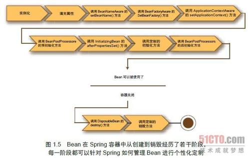

Spring Bean   
==========  

## 1. Bean的生命周期  

----------



正如你所见，在Bean 准备就绪之前，Bean 工厂执行了若干启动步骤。我们对图1.5进行详细描述。

1　Spring 对Bean 进行实例化。

2　Spring 将值和Bean 的引用注入进Bean 对应的属性中。

3　 如果Bean 实现了BeanNameAware 接口，Spring 将Bean 的ID 传递给setBeanName() 接口方法。

4　 如果Bean 实现了BeanFactoryAware 接口，Spring 将调用setBeanFactory()接口方法，将BeanFactory 容器实例传入。

5　 如果Bean 实现了ApplicationContextAware 接口，Spring 将调用setApplicationContext()接口方法，将应用上下文的引用传入。

6　 如果Bean 实现了BeanPostProcessor 接口，Spring 将调用它们的postProcessBeforeInitialization() 接口方法。

7　 如果Bean 实现了InitializingBean 接口，Spring 将调用它们的afterPropertiesSet() 接口方法。类似地，如果Bean 使用initmethod 声明了初始化方法，该方法也会被调用。

8　 如果Bean 实现了BeanPostProcessor 接口，Spring 将调用它们的postPoressAfterInitialization() 方法。

9　 此时此刻，Bean 已经准备就绪，可以被应用程序使用了，它们将一直驻留在应用上下文中，直到该应用上下文被销毁。

10　 如果Bean 实现了DisposableBean 接口，Spring 将调用它的destroy()接口方法。同样，如果Bean 使用destroy-method 声明了销毁方法，该方法也会被调用。


## 2. Bean的作用域

Spring定义了四种作用域：

1. 单例（Singletion）：在整个应用中，只创建一个实例；**默认情况；**

2. 原型（Prototype）：每次 注入（自动装配）或者通过Spring上下文获取的时候，都会创建一个新的Spring Bean实例。

3. 会话（Session）：在Web应用中，为每个会话创建一个Bean实例；

4. 请求（Request）：在Web应用中，为每次请求创建一个Bean实例；

例如：Prototype的作用域

   ```java
@Bean
@Scope(ConfigurableBeanFactory.SCOPE_PROTOTYPE)
public Notepad notepad(){
   return new Notepad();
}
   ```

例如：Session作用域，注意：轻易不要使用，不利于扩展（集群环境）。

```java
@Bean
@Scope(value=WebApplicationContext.SCOPE_SESSION,proxyModel=ScopedProxyModel.INTERFACES)
public ShoppingCart cart(){...}
```

这里：WebApplicationContext.SCOPE_SESSION属性指定了会话范围，proxyModel=ScopedProxyModel.INTERFACES指定了使用代理模式，因为会话Bean只有才web创建会话后，才有生效，而且会话Bean之间都要隔离，因此这里声明创建的一个代理类，JDK代理或者是CGLIB其会根据请求的sessionId来获取对应的会话Bean来操作。


## 3. 注入外部值

### 3.1 @PropertySource 声明属性源

```java
package com.sc.printer;

import org.springframework.core.env.Environment;

@Configuration
@PropertySource("claspath:/com/sc/print.properties") // 配置文件所在类路径
public class PrinterConfig{
    @Autowired
    private Environment env; // 注入环境对象
    @Bean
    public Printer printer(){
     return new Printer(env.getProperty("ip"),env.getProperty("port",Integer.class,445));
    }
}
```

@PropertySource("claspath:/com/sc/print.properties") ，这样是指定了默认的配置。

@PropertySource(name="config1",value="claspath:/com/sc/print.properties") ，这样是指定了代前缀的配置。

两种方式配置的属性源，如果要使用属性时的方式不一样。

第1种：@Value("${ip}")

第2种：@Value("#{config1['ip']}")

### 3.2 Spring Environment获取属性

可以通过如下代码，来注入一个Environment对象，然后通过这个Environment对象来获取，JVM的属性值、系统属性值、配置文件属性值等。

#### 3.2.1 获取Environment对象

```java
    @Autowired
    private Environment env; // 注入环境对象

```

#### 3.2.2 获取属性

String getProperty(String key);   // 获取一个字符串属性值;

String getProperty(String key,String defaultValue); // 获取一个字符串属性值，如果不存在则使用默认值;

String getRequiredProperty(String key) throws IllegalStateException; // 属性必须存在，否则抛出异常；

T getProperty(String key,Class<T> type); // 获取一个字符串属性值，并转换到对应的类型返回;

T getProperty(String key,Class<T> type,T defaultValue); // 获取一个字符串属性值，并转换到对应的类型返回，如果不存在则使用默认值;

例如：

int conectionCount = env.getProperty("db.conection.count" ,Integer.class ,30);

#### 3.2.3 判断属性是否存在

boolean exists = env.containsProperty(String key);

#### 3.2.4 属性解析到类

Class<DataSource>  dataSource= env.getPropertyAsClass("db1",DataSource.class);

例如：db1为配置属性前缀，DataSource.class为属性值装配的类。

待以后验证测试，目前感觉实现如下：

```java
public class DataSource {
    private String driverClass;
    private String url;
    private String username;
    private String password;
    getset方法;
}
```

配置类：

```properties
db1.driverClass="jdbc.oracle.Driver"
db1.url="192.168.5.36:1521/orcl"
db1.username="zdb"
db1.password="123456"
```

#### 3.2.5 profile

String[] getActiveProfiles();   // 返回激活profile名称数组；

String[] getDefaultProfiles();   // 返回默认的profile名称数组；

boolean acceptsProfiles(String ... profiles) // 判断是否支持指定的环境；，例如：当前是否为dev环境；

### 3.3 属性占位符方式 @Value

#### 3.3.1 使用属性占位符${}

如果使用属性占位符，则需要创建占位符配置bean，否则报错如下：

```java
@Bean
public class PropertySourcesPlaceholderConfigurer placeholderConfigurer(){
    return new PropertySourcesPlaceholderConfigurer();
}
```

例子：获取属性源中的某个属性，格式为：@Value("${属性名}")

```java
public class Printer{
    @Value("${printer.ip}")
    private String location;
    @Value("${printer.port}")
    private int port;
}
```

#### 3.3.2 使用SpEL表达式#{}

可以借助spring提供的SpEL表达式，在运行时计算得到值。

```java
@Value("#{systemProperties['JAVA_HOME']}") // 使用系统属性
private String javaHome; 
@Value("#{bean1.name}")  // 使用springBean的属性值,来赋值
private String name;
@Value("#{bean1.getName()}") // 调用springBean的方法,使用结果来赋值
private String name;
@Value("#{bean1.getName()?.toUpperCase()}") // 调用SpringBean方法,如果不为NULL,则转为大小
private String name;
@Value("#{T(java.lang.Math).PI}") // 获取某个静态类的静态属性，来赋值
private int pi;
@Value("#{T(java.lang.Math).random()}") // 调用静态类的方法，使用结果来赋值
private int port;
@Value("#{bean1.id+'by'+bean1.name}") // 字符串连加结果，来赋值
private String identify;
@Value("#{counter.total == 100}") // 算数运算符结果，来赋值
private boolean totalOk;
@Value("#{bean1.groups[4].id}") // 获取某个SpringBean的属性集合的第4个元素的id属性，来赋值
```

