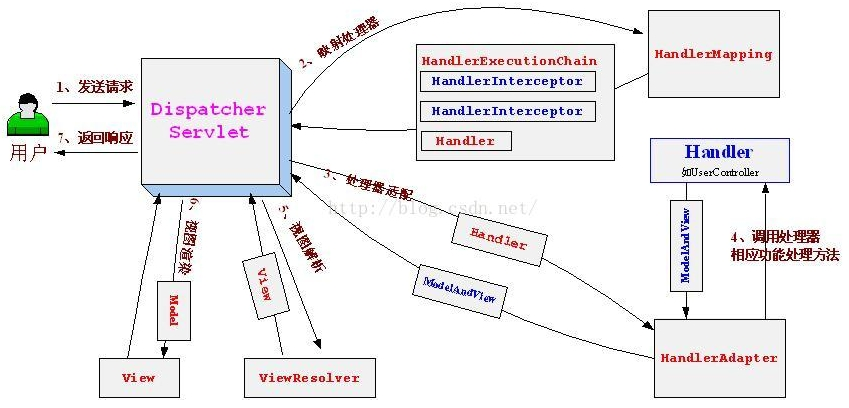

# Spring MVC





1. 请求信息到达DispatcherServlet。
2. DispathcerServlet通过处理器映射(HandlerMapping)，来获取请求URL对应的处理器(Handler)，并匹配关联拦截器(HandlerInterceptor)生成HandlerExecutionChain对象返回给DispathcerServlet。
3. DispatcherServlet会根据handler来获取对应HandlerAdapter。
4. 执行HandlerAdapter对象中的handler，返回ModelAndView对象给ServletDisapthcer。
5. ServletDispatcher根据视图名(viewName)和模型(model)来获取对应的视图对象(View)。
6. ServletDisaptcher执行View的渲染操作，使用model数据替换视图中的变量。
7. 最后响应处理返回响应给用户。

尽管Spring Boot简化了Spring MVC，但基于JavaConfig的SpringMVC本身已经很简单了，而且JavaConfig的SpringMVC是Spring Boot的基础，因此下面我们介绍基于JavaConfig的SpringMVC。

## 2.配置SpringMVC

### 2.1 配置DispatchServlet

```java
package com.sc.web.config;
/**
* web应用初始化
**/
public class WebAppInitializer extends 	      AbstractAnnotationConfigDispatcherServletInitializer {
       
    /**
    * DispatcherServlet请求映射，匹配的请求由DispathcerServlet来处理
    **/
    @Override
    protected String[] getServletMappings(){
        return new String[] {"/"};
    }
    /**
    * 获取应用级的配置上下文类,这个配置类必须由@Configurational声明
    * 这个上下文配置类通常去扫描@Service、@Respository和@Component声明的类
    **/
    @Override
    protected Class<?>[] getRootConfigClasses(){
        return new Class<?>[] {RootConfig.class};
    }
    /**
    * 获取web级的配置上下文类,这个配置类必须由@Configurational声明
    * 这个上下文配置类通常去扫描@Controller声明类
    **/
    @Override
    protected Class<?>[] getServletConfigClasses(){
        return new Class<?>[] {WebConfig.class};
    }
    /**
    * 通过重载本方法，我们可以对DispatcherServlet进行额外的配置。
    * 借助本方法参数registration，我们能完成多项任务，包括：
    * setLoadOnStatrtup调整load-on-startup优先级；
    * setInitParameter设置初始化参数；
    * setMultipartConfig配置Servlet3.0对multipart的支持；
    *
    **/
    @Override
    protected void customizeRegistration(Dynamic registration){
        registration.setMultipartConfig(new MultipartConfigElement("/tmp/spitter/uploads"),2097152,4194304,0);
    }
    /**
    * 为当前DispathcerServlet指定过滤器
    **/
    @Override
    protected Filter[] getServletFilters() {
        return new Filter[]{new MyFilter()};
    }
}
```

由于这个WebAppInitializer类继承了AbstractAnnotationConfigDispatcherServletInitializer，而AbstractAnnotationConfigDispatcherServletInitializer又实现了Servlet 3.0标准的javax.servlet.ServlcetContainerInitializer接口类，如果部署到Servlet3.0容器，容器会自动发现它，并用它来配置Servlet上下文。

### 2.2 应用级bean上下文 - RootConfig.class

应用级bean上下文RootConfig.class，通常是加载和配置应用后端的中间层和数据层组件。例如：@Service和@Respository声明的类。下面的例子，就是扫描整个应用的Bean，但要排除web相关的bean。

```java
package com.sc.config;
/**
* 扫描整个应用的bean,但不应包括web相关的bean
**/
@Conditional
@ComponentScan(basePackages={"com.sc"},
    excludeFilters={
        @Filter(type=FilterType.ANNOTATION,value=EnableWebMvc.class),
        @Filter(type=FilterType.ANNOTATION,value=Controller.class),
    }           
) 
public class RootConfig {
}

```

### 2.3 web级bean上下文 - WebConfig.class

web级bean上下文WebConfig.class，通常是加载和配置web级相关的组件，例如：DispatcherServlet使用的系统组件，例如：视图解析器、请求映射器等，还有就是你编写的控制器@Controller。

```java
package com.sc.web.config;
/**
* 扫描web相关的bean
**/
@Conditional
@ComponentScan(basePackages={"com.sc.web"})
@EnableWebMvc
public class WebConfig extends WebMvcConfigurerAdapter{
    /**
    * 声明视图解析器
    **/
    @Bean
    public ViewResolver viewResolver(){
        InternalResourceViewResolver resolver = new InternalResourceViewResolver();
        resolver.setPrefix("/WEB-INF/views");
        resolver.setSuffix(".jsp");
        resolver.setExposeContextBeansAsAttributes(true);
        return resolver;
    }
    /**
    * 配置静态页面由tomcat的DefaultServlet来处理
    **/
    @Override
    public void configureDefaultServletHandling(DefaultServletHandlerConfigurer configurer){
        configurer.enable();
    }
}
```

## 3. 简单的例子

```java
@Controller
public class Spittler{

    @Autowired
    private SpittlerRespository spittlerRespository;
    /**
    * 获取某个页号的spittle集合
    * 例子:演示@RequestParam源注释
    */
    @GetMapping("/spittles")
    public String spittles(@RequestParam(value="pageNo",defaultValue="1") long pageNo,Model model) {
        model.addAttribute("spittles",this.spittlerRespository.findSpittles(pageNo));
        return "/spittle/index";
    }
    /**
    * 获取某个id的spittle
    * 例子:演示@PathVariable源注释
    **/
    @GetMapping("/spittles/{spittleId}")
    public String showSpittleById(@PathVariable long spittleId, Model model){
        Spittle spittle = this.spittlerRespository.findOne(spittleId);
        model.addAttribute("spittle",spittle);
        return "/spittle/view_spittle";
    }
    /**
    * 增加Spittle
    * 例子:演示进入到增加表单页
    **/
    @GetMapping("/spittle")
    public String addSpittleForm(){
        return "/add_spittle";
    }
    /**
    * 增加Spittle
    * 例子:演示Post提交、参数绑定、@Valid、Errors
    * 下面会给出Spitter的表单类,演示表单类属性验证
    **/
    @PostMappng("/spittles/")
    public String addSpittleSubmit(@Valid Spitter spitter,Errors errors){
        if(errors.hasErrors()){
            return "/add_spittle";
        }
        spittlerRespository.save(spittler);
        return "redirect:/spitter/"+spitter.getId();
    }
}
```

@Valid Spitter spitter对应表单类的属性验证声明

```java
public String Spitter {
    private Long id;
    
    @NotNull
    @Size(min=5,max=16)
    private String username;
    
    @NotNull
    @Size(min=5,max=16)
    private String password;
}
```

## 4. 渲染Web视图

### 4.1视图解析接口

#### 4.1.1 视图解析器接口(解析视图对象)

SpringMVC定义了一个名为ViewResolver(视图解析器)的接口，用于根据viewName(视图名)获取对应的View(视图对象)，如下：

```java
public interface ViewResolver{
    View resolverViewName(String viewName,Locale locale) throws Exception;
}
```

#### 4.1.2 视图接口(渲染输出)

使用View视图对象的render(渲染)方法，根据model(数据)来渲染输出到Response(响应)对象，如下：

```java
public interface View {
    void render(Map<String,?> model,HttpServletRequest request,HttpServletResponse response);
    
}
```

### 4.1.3 常用的视图解析

Spring提供了14种视图解析器，例如：InternalResourceViewResolver、VelocityViewResolver、FreeMarkerViewResolver、ThymeleafViewResolver等。

## 5.使用Thymeleaf

### 5.1 配置Thymeleaf视图解析器

```java
package com.sc.web.config;
/**
* 扫描web相关的bean
**/
@Conditional
@ComponentScan(basePackages={"com.sc.web"})
@EnableWebMvc
public class WebConfig extends WebMvcConfigurerAdapter{
    /**
    * 声明视图解析器bean
    * @param templateEngine Thymeleaf的模板引擎
    **/
    @Bean
    public ViewResolver viewResolver(ThymeleafTemplateEngine templateEngine){
        ThymeleafViewResolver viewResolver = new ThymeleafViewResolver();
        viewResolver.setTemplateEngine(templateEngine);
        return viewResolver;
    }
    /**
    * 声明模板引擎bean
    * @param templateResolver 模板解析器
    **/
    @Bean
    public TemplateEngine templateEngine(TemplateResolver templateResolver){
        SpringTemplateEngine templateEngine = new SpringTemplateEngine();
        templateEngine.setTemplateResolver(templateResolver);
        return templateEngine;
        
    }
    /**
    * 声明默认解析器bean
    **/
    @Bean
    public TemplateResolver templateResolver(){
        TemplateResolver templateResolver = new ServletContextTemplateResolver();
        templateResolver.setPrefix("/WEB-INF/templates");
        templateResolver.setSuffix(".html");
        templateResolver.setTemplateMode("HTML5");
        return templateResolver;
    }
    /**
    * 配置静态页面由tomcat的DefaultServlet来处理
    **/
    @Override
    public void configureDefaultServletHandling(DefaultServletHandlerConfigurer configurer){
        configurer.enable();
    }
}
```

### 5.2 定义Thymeleaf模板

Thymeleaf很大程度上就是HTML文件，它没有特殊的标签，它通过自定义的命名空间，为标准的HTML标签集合添加Thymeleaf属性。

如下，一个Thymeleaf例子：

```html
<html xmlns="http://www.w3.org/1999/xhtml"
      xmlns:th="http://www.thymeleaf.org"> <!-- 声明Thymeleaf命名空间 -->
    <head>
        <title>Spitter</title>
        <!-- 到样式表的th:href链接 -->
        <link ref="Stylesheet" type="text/css" th:href="@{/resources/style.css}"></link>
    </head>
    <body>
        <!-- th:object 绑定的form对象 -->
        <form method="POST" th:object="{spitter}">
            <!-- th:if 判断表达式是否为true ${#对象.方法('参数')}调用方法 -->
            <div class="errors" th:if="${#fields.hasErrors('*')}">
                <ul>
                    <!--th:each遍历 -->
                    <li th:each="err : ${#fields.errors('*')}"
                        <!-- th:text显示变量值 -->
                        th:text="${err}">Input is incorrect</li>
                </ul>
            </div>
        	<!-- th:class 根据后面的表达判断，如果成立则为error样式 -->
        	<lable th:class="${#fields.hasError('username')}? 'error'">User name</lable>
        	<!-- th:field 绑定form对象的属性名 -->
        	<input type="text" th:field="*{username}" th:class="${#fields.hasError('username')}? 'error'" /><br/>
        	<input type="submit" value="add" />
        </form>
	</body>
</html>
```

## 6.添加Servlet、Filter、Listener

通过WebApplicationInitializer来注册Servlet、Filter、Listener，因为其实现了Servlet 3.0的WebApplicationInitializer接口，那么Servlet3.0容器启动时会执行实现WebApplicationInitializer接口的类。

例如：

```java
import javax.servlet.ServletRegistration.Dynamic;

public class CustomWebApplicationInitializer implements WebApplicationInitializer {
    @Override
    public void onStartup(ServletContext servletContext) throws ServletException {
        // 注册Servlet
        Dynamic myServlet = servletContext.addServlet("myServlet",MyServlet.class);
        myServlet.addMapping("/custom/**");
        // 注册Filter
        Dynamic myFilter = servletContext.addFilter("myFilter",MyFilter.class);
        myFilter.addMappingForUrlPatterns(null,false,"/custom/*");
        // 注册Listener
    }
}
```

## 7. 处理multipart数据

multipart格式的数据会将一个表单拆分为多个部分（part），每个部分对应一个输入域。在一般的表单输入域中，它所对应的部分中会放置文本型数据，但如果上传文件的话，它对应的部分可以是二进制。

如下是一个基于multipart格式请求：

```
------WebKitFormBoundaryqgkaBn8IHJCuNmiW

Content-Disposition: form-data; name="firstName"Charles

------WebKitFormBoundaryqgkaBn8IHJCuNmiW

Content-Disposition: form-data; name="lastName"Xavier

------WebKitFormBoundaryqgkaBn8IHJCuNmiW

Content-Disposition: form-data; name="email"charles@xmen.com

------WebKitFormBoundaryqgkaBn8IHJCuNmiW

Content-Disposition: form-data; name="username"professorx

------WebKitFormBoundaryqgkaBn8IHJCuNmiW

Content-Disposition: form-data; name="password"letmein01

------WebKitFormBoundaryqgkaBn8IHJCuNmiW

Content-Disposition: form-data; name="profilePicture"; filename="me.jpg"Content-Type: image/jpeg

[[ Binary image data goes here ]]

------WebKitFormBoundaryqgkaBn8IHJCuNmiW--
```

Spring3.1 提供了两个MultipartResolver:

1. CommonsMultipartResolver，使用Jakarta Common FileUpload解析multipart请求。

2. StandardServletMultipartResolver，依赖于Servlet3.0对mutlipart请求支持。

   

### 7.1 使用Serlvet3.0 解析mutlipart请求

```java
package com.sc.web.config;
/**
* 扫描web相关的bean
**/
@Conditional
@ComponentScan(basePackages={"com.sc.web"})
@EnableWebMvc
public class WebConfig extends WebMvcConfigurerAdapter{
    // 基于上面的Thymeleaft webConfig加入如下MultipartResolver的bean
    // 注意:如果处理multipart请求使用的Servlet3.0的@RequestPart则没有必要配置这个MultipartResolver，只有使用MultipartFile才需要这个bean.
    @Bean
    public MultipartResolver multipartResolver() throws IOException {
        return new StandardServletMultipartResolver();
    }
    
}
```

上传限制的配置，参见DispatcherServlet的配置部分。

### 7.2 处理Multipart请求

```java
@PostMapping("/register")
public String processRegistration(@RequestPart("profilePicture") Part profilePicture,@Valid Spitter spitter,Errors erros){

}

```

javax.servlet.http.Part 接口方法：

```java

public interface Part {
   public InputStream getInputStream() throws IOException;
   public String getContentType();
   public String getName();
   public String getSubmittedFileName();
   public long getSize();
   public void write(String fileName) throws IOException;
   public void delete() throws IOException;
   public String getHeader(String name);
   public Collection<String> getHeaders(String name);
   public Collection<String> getHeaderNames();
}
```


## 8.异常处理

spring提供了多种方式将异常转换为响应

### 8.1 将异常直接映射为HTTP状态码

抛出如下异常，会自动转发到响应的状态码输出返回给浏览器。

```java
Spring异常	HTTP状态码
BindException	400 - Bad Request
ConversionNotSupportedException	500 - Internal Server Error
HttpMediaTypeNotAcceptableException	406 - Not Acceptable
HttpMediaTypeNotSupportedException	415 - Unsupported Media Type
HttpMessageNotReadableException	400 - Bad Request
MissingServletRequestParameterException	400 - Bad Request
MissingServletRequestPartException	400 - Bad Request
NoSuchRequestHandlingMethodException	404 - Not Found
TypeMismatchException	400 - Bad Request
HttpMessageNotWritableException	500 - Internal Server Error
HttpRequestMethodNotSupportedException	405 - Method Not Allowed
```

### 8.2 为抛出的异常指定状态码和错误信息

为异常类声明@ReponseStatus源注释，如果程序抛出异常，则按照源注释声明的状态码和错误信息返回。

```java
@ResponseStatus(value=HttpStatus.NOT_FOUND,reason="Spittle Not Found")
public class SpittleNotFoundException extends RuntimeException {
}
```

### 8.3 为控制器类指定异常处理方法

使用@ExceptionHandler注释所标注的方法(异常处理方法)，能够处理同一个控制器类中运行方法抛出的某个类异常。

```java
@ExceptionHandler(DuplicateSpittleException.class)
public String handleDuplicateSpittle(){
    return "err/duplicate";
}
```

例如：如果某个控制的方法抛出了DuplicateSpittleException异常，则本方法或被执行用来处理DuplicateSpittleException异常。

使用专用异常处理方法的好处，解放控制器的业务方法，使其不用过多的关系异常，异常有专业的方法来处理。

例如：

原方法，要在业务方法中考虑异常处理；

```java
@RequestMapping(method=RequestMethod.POST)
public String saveSpittle(SpittleForm form,Model model){
    try{
        spittleRepository.save(new Spittle(null,form,getMessage(),new Date()));
        return "redirect:/spittles";
    }catch(DuplicateSpittleException e){
        return "err/duplicate";
    }
}
```

新方法，分离业务和异常处理；

```java
@RequestMapping(method=RequestMethod.POST)
public String saveSpittle(SpittleForm form,Model model){
    spittleRepository.save(new Spittle(null,form,getMessage(),new Date()));
    return "redirect:/spittles";
}
     
@ExceptionHandler(DuplicateSpittleException.class)
public String handlerDuplicateSpittle(){
    return "err/duplicate";
}
```

### 8.4 基于通知(AOP)来处理全局异常

@ExceptionHandler只对本控制类的某种特定异常处理有效(参见上面的8.3)，如果整个应用(多个控制器)都会抛出相同的异常，如果每个控制器都声明一个相同的@ExceptionHandler处理方法，这显然不合适。Spring 3.2引入了新的解决方案，控制器通知，任意带有@ControllerAdvice注释的类，会处理整个应用所有控制器中带有@RequestMapping注释方法抛出的异常。

例如：

```java
@ControllerAdvice
public class WebExceptionHandler {
    
    @ExceptionHandler(DuplicateSpittleException.class)
    public String handlerDuplicateSpittle(){
        return "err/duplicate";
    }
    
}
```

如上的例子任何一个控制器如果抛出了DuplicateSpittleException异常，都统一有这个方法来处理。

**全局声明**

通知器通知@ControllerAdvice不只能用来处理全局异常，其还能使用@InitBinder标注的方法，来初始化全局请求参数绑定器。使用@ModelAttribute标注的方法，在为每个请求执行到渲染页面前，执行这个model数据填充方法。

## 9.post请求后执行一下重定向

在处理完POST请求后，通常来讲一个最佳实践就是执行一下重定向。这样做能够防止用户点击浏览器刷新和后退按钮时，客户端重新执行危险的POST请求。

例如：

```java
    @PostMappng("/spittles/")
    public String addSpittleSubmit(@Valid Spitter spitter,Errors errors){
        if(errors.hasErrors()){
            return "/add_spittle";
        }
        spittlerRespository.save(spittler);
        return "redirect:/spitter/"+spitter.getId();
    }
```

### 9.1 通过URL模板进行重定向

例如：

```java
    @PostMappng("/spittles/")
    public String addSpittleSubmit(@Valid Spitter spitter,Errors errors,Model model){
        if(errors.hasErrors()){
            return "/add_spittle";
        }
        spittlerRespository.save(spittler);
        model.addAttribute("username",spitter.getUsername());
        model.addAttribute("spitterId",spitter.getId());
        return "redirect:/spitter/{spitterId}";
    }
```

观察最后的"redirect:/spitter/{spitterId}"，其{spitterId}会使用上面的model中的spitterId填充，其余没在URL模板中出现的model属性，会以URL参数的形式添加到重定向url的后面，如上例子的重定向url为：

/spitter/123?username=黑哥

### 9.2 使用flash属性重定向

按照定义flash属性会一直携带相关的数据直到下一次请求，然后才会消失。

Spring他看过了通过RedirectAttribute设置flash属性的方法，其继承于Model接口，在原有Model接口方法的基础上有添加了addFlashAttribute()方法，例如：

```java
    @PostMappng("/spittles/")
    public String addSpittleSubmit(@Valid Spitter spitter,Errors errors,RedirectAttribute model){
        if(errors.hasErrors()){
            return "/add_spittle";
        }
        spittlerRespository.save(spittler);
        model.addAttribute("spitterId",spitter.getId());
        model.addFlashAttribute("spitter",spitter); // 这个属性会被存放到session
        return "redirect:/spitter/{spitterId}";
    }
```

获取flash属性的例子：

```java
@GetMapping("/spitter/{spitterId}")
public String showSpitter(@Path String spitterId,Model model){
    // 优先查找会话中是否有spitter对象(因为上面的post方法中addFlashAttribute已经存放spitter到会话了)
    if(model.containsAttribute("spitter")){
       return "view_spitter";
    }else{
        model.addAttribute("spitter",spitterRepository.findOne("spitterId"));
        return "view_spitter";
    }
}
```

因为基于flash要基于session来存放数据，因此在分布式的web系统中，需要使用会话黏贴或者基于redis来存放会话内容，否则不建议使用flash属性。

